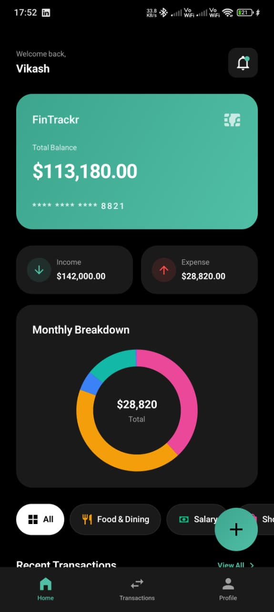
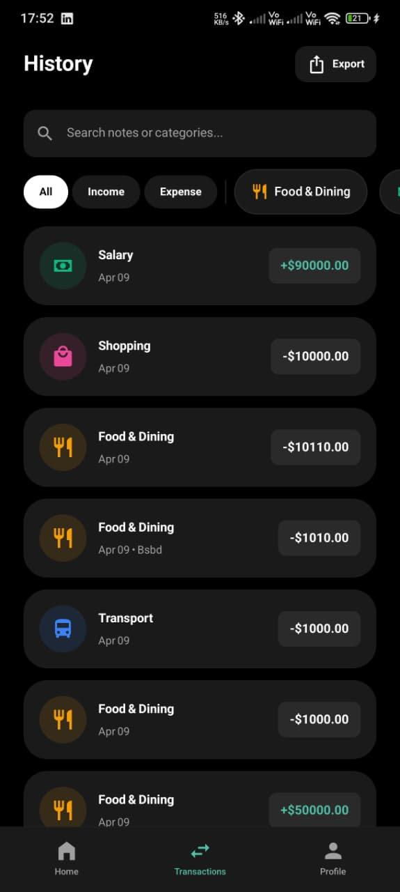
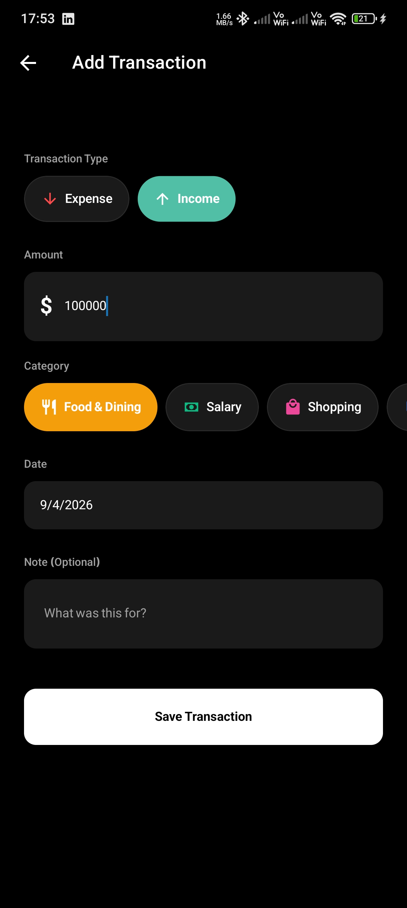
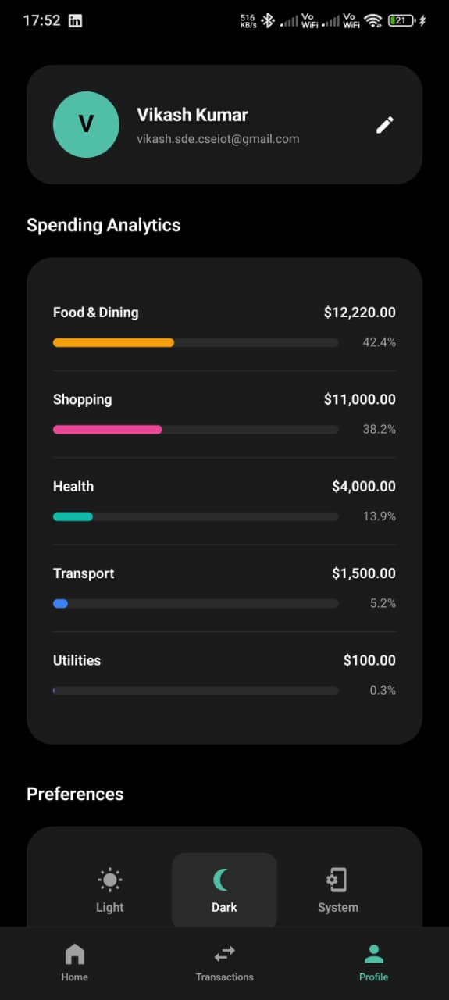
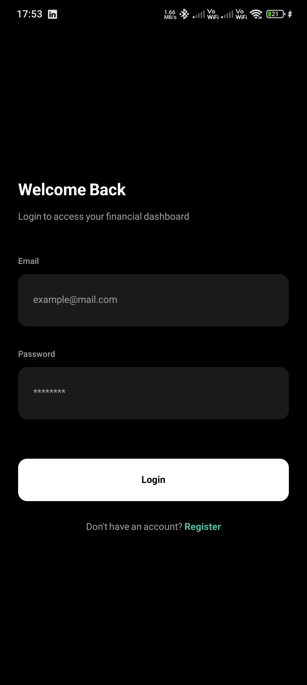
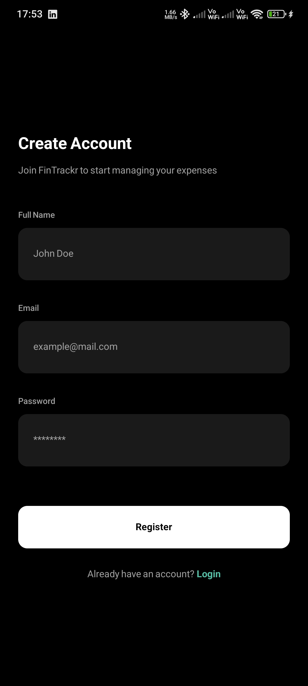

# FinTrackr - Finance Manager

FinTrackr is a modern fintech-style mobile application built with React Native and Expo. It allows users to manage income, expenses, and monthly financial summaries with a premium UI.

## 📱 App Preview

| Dashboard | History | Add Transaction | Profile |
| :---: | :---: | :---: | :---: |
|  |  |  |  |

### Authentication

| Login | Register |
| :---: | :---: |
|  |  |

---

## 🛠 Assignment Requirements Checklist

### Core Requirements
- [x] Gradient-based UI (Fintech style)
- [x] Dark / Light mode toggle
- [x] Bottom Tab Navigation (3+ tabs)
- [x] Animations (Micro-interactions & screen transitions)
- [x] Keyboard handling (Smooth form UX)
- [x] Build Delivery (EAS build instructions)
- [x] Proper GitHub Repository & Documentation

### Feature Requirements
- [x] Add Income / Expense transactions
- [x] Transaction fields: amount, category, date, note
- [x] Form validation
- [x] Category-based tracking (Visual distinction)
- [x] Monthly summary (Income, Expenses, Balance)
- [x] Local storage (SQLite & AsyncStorage)

### Bonus Features
- [x] Animated pie charts and graphs
- [x] Swipe gestures for interactions
- [x] Smart empty states

---

## Tech Stack

- **Framework**: React Native with Expo (SDK 55)
- **Navigation**: Expo Router (File-based)
- **Backend & Database**: **Supabase** (PostgreSQL)
- **State**: Zustand with persistence
- **Storage**: SQLite and AsyncStorage (Local-first caching)
- **Animations**: Reanimated and Expo Linear Gradient
- **Charts**: Gifted Charts
- **Icons**: Expo Vector Icons

---

## Backend Architecture

FinTrackr uses a hybrid backend-local storage model:
- **Supabase Auth**: Secure user authentication and session management.
- **Supabase Database**: Real-time synchronization of transactions across devices.
- **SQLite Persistence**: Used as a robust alternative to AsyncStorage for Supabase's offline auth state.
- **Zustand Persist**: Local caching for an instantaneous, offline-available UI.

---

## Setup & Installation

### Prerequisites
- Node.js (LTS)
- Expo Go app for testing
- EAS CLI (for builds)

### Installation Steps
1. Clone the repository:
   ```bash
   git clone https://github.com/vikashkrdeveloper/FinTrackr-Mobile.git
   ```
2. Install dependencies:
   ```bash
   npm install
   ```
3. Create a `.env` file with Supabase credentials (optional for cloud sync):
   ```env
   EXPO_PUBLIC_SUPABASE_URL=your-url
   EXPO_PUBLIC_SUPABASE_ANON_KEY=your-key
   ```
4. Start the development server:
   ```bash
   npx expo start -c
   ```

---

## 👨‍💻 Author

- **Vikash Kumar**
- LinkedIn: [linkedin.com/in/vikashkrdeveloper](https://linkedin.com/in/vikashkrdeveloper)

---

## 📄 License
MIT License

